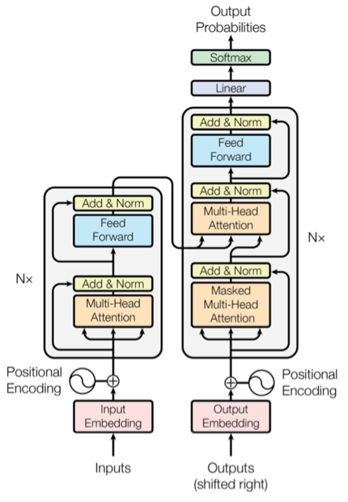

# 🤖 Transformers from Scratch

## Project Overview

This project is a deep dive into building transformer models from the ground up using JAX and Flax. Our goal is to demystify the intricate world of large language models (LLMs) by implementing key components incrementally, providing a clear, step-by-step understanding of transformer architecture.

## 🌟 Key Features

- **Incremental Model Development**: From simple bigram models to complex transformer architectures
- **Lightweight Implementation**: Using the "tiny shakespeare" dataset for efficient exploration
- **JAX & Flax Powered**: Leveraging modern machine learning frameworks

## 🏗️ Model Progression

### 1. Bigram Model
- Starting point for understanding autoregressive language modeling
- Introduces fundamental token embedding techniques
- Serves as infrastructure for more complex models

### 2. Scaled Self-Attention

- Explores the core attention mechanism
- Demonstrates interaction between query, key, and value vectors
- Fundamental to understanding transformer architecture

### 3. Multi-Headed Self-Attention

- Implements parallel scaled self-attention blocks
- Captures diverse representation subspaces
- Enables more complex information extraction

### 4. Transformer Decoder

- Combines advanced deep learning techniques
- Introduces skip connections and layer normalization
- Scalable and repeatable block design

### 5. GPT-2 Exploration
- Scaled version of transformer decoder
- Demonstrates model scaling strategies
- Vocabulary and architecture exploration

## 🛠️ Installation

### Prerequisites
- Python 3.8+
- GPU (recommended)

### Installation Steps
```bash
# For GPU users
pip install -U "jax[cuda12]"

# Additional requirements
pip install flax optax numpy jupyter
```

## 🎓 Learning Resources

This project draws inspiration from and references:
- Andrej Karpathy's GPT Implementation

## 🚀 Project Status
**Work in Progress** - Actively developing and documenting transformer components
